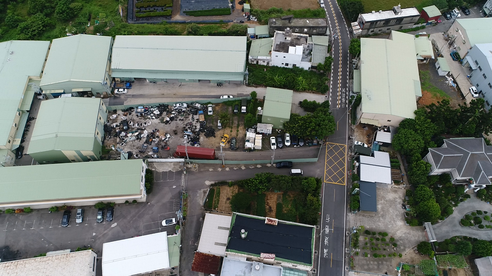
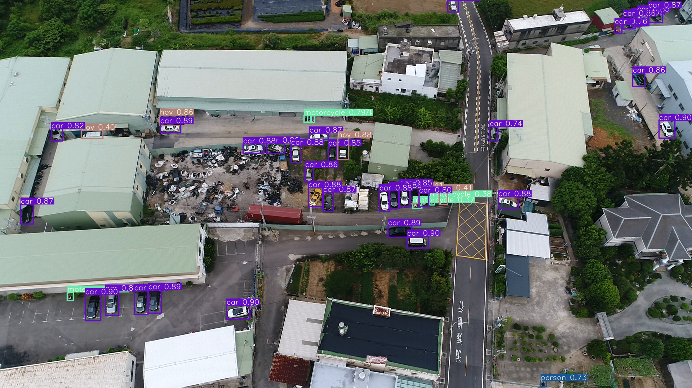
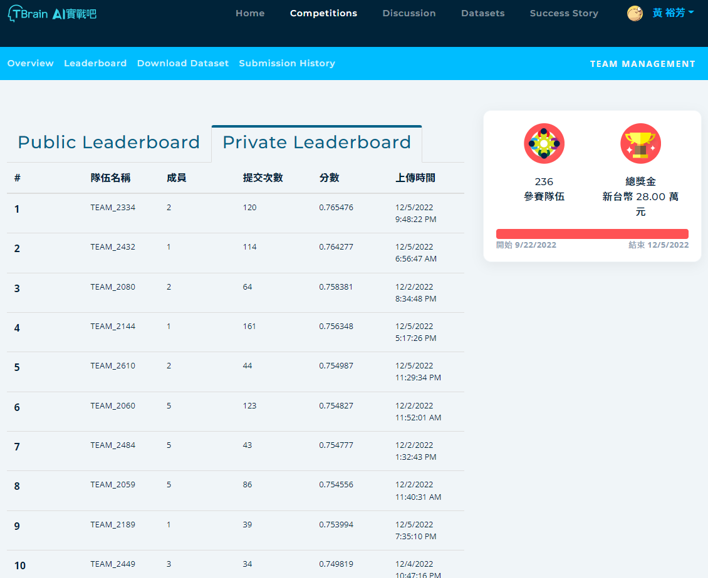

# Aicup_drone-2022 無人機飛行載具之智慧計數競賽

## 指導教授: 劉宗榮  

## 隊名: TEAM_2060

## 隊長 : [黃裕芳](https://github.com/Andrewhsin)  組員: 蘇郁宸, 林峻安, [陳柏瑋](https://github.com/bobo0303), 賴亭旭  

Implementation of paper - [YOLOv7: Trainable bag-of-freebies sets new state-of-the-art for real-time object detectors](https://arxiv.org/abs/2207.02696)

Competitions - [Aicup_drone-2022](https://tbrain.trendmicro.com.tw/Competitions/Details/25)



```
├── README.md    

主要訓練程式碼
├── runs
│   ├── train               存放訓練權重資料夾
│   ├── detect              存放 public & private 輸出資料夾 
│   └── save                存放 public & private .csv 輸出資料夾 
├── make_txt.py             把主辦單位給的csv轉成相關格式
├── 目標數據集
│   ├── train.txt           轉檔後的訓練標籤檔
│   ├── val.txt             轉檔後的驗證標籤檔 
│   ├── train               存放 train 的 image & labels 資料夾
│   └── save                存放 val 的 image & labels 資料夾
├── train.py                執行訓練及其他參數調整
├── runs
│   ├── train               存放訓練權重資料夾
│   ├── detect              存放 public & private 輸出資料夾 
│   └── save                存放 public & private .csv 輸出資料夾 
├── data_arg
│   ├── ENSEMBLE            不同模型 & csv 結合
│   ├── AUGMENTATION_       資料擴增、翻轉、旋轉       
│   └── PSUEDO_LABEL        將輸出結果 PSUEDO_LABEL
│
├── log                     訓練loss可視化(tensorboard)
├── wandb                   訓練loss可視化(wandb)
├── yolov7.pt               YOLOv7 pretrained model
├── yolov7_w6.pt            YOLOv7_w6 pretrained model   

主要測試程式碼

├── detect.py               輸出 public & private 資料集
├── csv_output.py             將 public & private 資料集結果轉為.csv  

```


## Web Demo

- Integrated into [Huggingface Spaces 🤗](https://huggingface.co/spaces/akhaliq/yolov7) using [Gradio](https://github.com/gradio-app/gradio). Try out the Web Demo [](https://huggingface.co/spaces/akhaliq/yolov7)

## Performance 


## Installation

Docker environment (recommended)
<details><summary> <b>Expand</b> </summary>

```
# create the docker container, you can change the share memory size if you have more.
nvidia-docker run --name yolov7 -it -v your_coco_path/:/coco/ -v your_code_path/:/yolov7 --shm-size=64g nvcr.io/nvidia/pytorch:21.08-py3

# apt install required packages
apt update
apt install -y zip htop screen libgl1-mesa-glx

# pip install required packages
pip install seaborn thop

# go to code folder
cd /yolov7
```

</details>

## Training

1. 準備Ground truth label (`train.txt`/`val.txt`)  
   並將訓練圖片放入training資料夾，label格式如下
    ```
    E:/Aicup_drone/image_path/train/images/img10001.jpg
    E:/Aicup_drone/image_path/train/images/img10002.jpg
    E:/Aicup_drone/image_path/train/images/img10003.jpg
    E:/Aicup_drone/image_path/train/images/img10004.jpg
    ...
    ```


Single GPU training

```
python train.py --workers 8 --device 0 --batch-size 32 --data data/coco.yaml --img 640 640 --cfg cfg/training/yolov7.yaml --weights '' --name yolov7 --hyp data/hyp.scratch.p5.yaml

python train.py --workers 8 --device 0 --batch-size 32 --data data/coco.yaml --img 640 640 --cfg cfg/training/yolov7x.yaml --weights '' --name yolov7x --hyp data/hyp.scratch.p5.yaml
```

Multiple GPU training

```
python -m torch.distributed.launch --nproc_per_node 4 --master_port 9527 train.py --workers 8 --device 0,1,2,3 --sync-bn --batch-size 128 --data data/coco.yaml --img 640 640 --cfg cfg/training/yolov7.yaml --weights '' --name yolov7 --hyp data/hyp.scratch.p5.yaml

python -m torch.distributed.launch --nproc_per_node 4 --master_port 9527 train.py --workers 8 --device 0,1,2,3 --sync-bn --batch-size 128 --data data/coco.yaml --img 640 640 --cfg cfg/training/yolov7x.yaml --weights '' --name yolov7x --hyp data/hyp.scratch.p5.yaml
```

## Inference

## 1.1 相關測試參數設定
1. [AI CUP 競賽報告](https://drive.google.com/file/d/1puLpWeq7S_aKfyerbI9787HfJ-Fl19_l/view?usp=sharing)  
2. [AI CUP 實驗記錄](https://drive.google.com/file/d/1tNn-kyzaWkC-EPw4iEtFYSf3xShvJVQq/view?usp=sharing)  
3. [Public data](https://drive.google.com/drive/folders/1lx4rOFNm1ayZOFxhmhru6AoiEg05JO4O?usp=sharing)
4. [Private data](https://drive.google.com/drive/folders/1n52IcT7IGtNQ5OG2wetj__WAki9ajiRO?usp=sharing)
5. 測試時不需要更改相關路徑，只須確定所有相對路徑內是否有圖片即可  
6. 測試時所有更改參數的地方都在`名稱.yaml`進行更改  
7. 預設測試資料路徑: `./inference/images/`
8. 預設測試結果路徑: `./runs/detect/`

`python detect.py --weights yolov7.pt --conf 0.25 --img-size 640 --source inference/`




## 2.2 測試分數
- 我們每次上傳分數都會留下當次測試的參數細節、偵測結果圖與測試分數  
  若有需要可以聯絡我們 再把所有完整檔案分批傳送
  
  


## Citation

```
@article{wang2022yolov7,
  title={{YOLOv7}: Trainable bag-of-freebies sets new state-of-the-art for real-time object detectors},
  author={Wang, Chien-Yao and Bochkovskiy, Alexey and Liao, Hong-Yuan Mark},
  journal={arXiv preprint arXiv:2207.02696},
  year={2022}
}
```


## Acknowledgements

<details><summary> <b>Expand</b> </summary>

* [https://github.com/AlexeyAB/darknet](https://github.com/AlexeyAB/darknet)
* [https://github.com/WongKinYiu/yolov7](https://github.com/WongKinYiu/yolov7)
* [https://github.com/WongKinYiu/yolor](https://github.com/WongKinYiu/yolor)
* [https://github.com/WongKinYiu/PyTorch_YOLOv4](https://github.com/WongKinYiu/PyTorch_YOLOv4)
* [https://github.com/WongKinYiu/ScaledYOLOv4](https://github.com/WongKinYiu/ScaledYOLOv4)
* [https://github.com/Megvii-BaseDetection/YOLOX](https://github.com/Megvii-BaseDetection/YOLOX)
* [https://github.com/ultralytics/yolov3](https://github.com/ultralytics/yolov3)
* [https://github.com/ultralytics/yolov5](https://github.com/ultralytics/yolov5)
* [https://github.com/DingXiaoH/RepVGG](https://github.com/DingXiaoH/RepVGG)
* [https://github.com/JUGGHM/OREPA_CVPR2022](https://github.com/JUGGHM/OREPA_CVPR2022)

</details>
